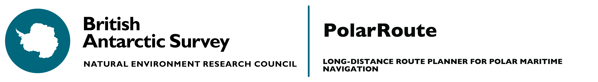

# PolarRoute



<a href="https://antarctica.github.io/PolarRoute/">
<a href="https://colab.research.google.com/drive/12D-CN10X7xAcXn_df0zNLHtdiiXxZVkz?usp=sharing">
<a href="https://pypi.org/project/polar-route/">
<a href="https://github.com/bas-amop/PolarRoute/tags"></a>
<a href="https://github.com/bas-amop/PolarRoute/issues"></a>
<a href="https://github.com/bas-amop/PolarRoute/blob/main/LICENSE"></a>

PolarRoute is a long-distance maritime polar route planning package, able to take into account complex and changing environmental conditions. It allows the construction of optimised routes through three main stages: discrete modelling of the environmental conditions using a non-uniform mesh, the construction of mesh-optimal paths, and physics informed path smoothing. In order to account for different vehicle properties we construct a series of data-driven functions that can be applied to the environmental mesh to determine the speed limitations and fuel requirements for a given vessel and mesh cell. The environmental modelling component of this functionality is provided by the [MeshiPhi](https://github.com/bas-amop/MeshiPhi) library.

## Installation

PolarRoute is available from [PyPI](https://pypi.org/project/polar-route/) and the latest version can be installed by running: 

```
pip install polar-route
```

Alternatively you can install PolarRoute by downloading the source code from GitHub:
```
git clone https://github.com/bas-amop/PolarRoute
cd PolarRoute
pip install -e .
```

Use of `-e` is optional, based on whether you want to be able to edit the installed copy of the package.

In order to run the test suite you will also need to include the `test` dependency group:

```
pip install --group test
```

> NOTE: Some features of the PolarRoute package require GDAL to be installed. Please consult the [documentation](https://bas-amop.github.io/PolarRoute) for further guidance.

## Required Data sources
PolarRoute has been built to work with a variety of open-source atmospheric and oceanographic data sources. For testing and demonstration purposes it is also possible to generate artificial Gaussian Random Field data.  

A full list of supported data sources and their associated dataloaders is given in the  'Dataloader Overview' section of the [MeshiPhi manual](https://bas-amop.github.io/MeshiPhi/)

## Developers
Samuel Hall, Harrison Abbot, Ayat Fekry, George Coombs, David Wyld, Thomas Zwagerman, Jonathan Smith, Maria Fox, and James Byrne

## License
This software is licensed under a MIT license, but request users cite our publication: 

Jonathan D. Smith, Samuel Hall, George Coombs, James Byrne, Michael A. S. Thorne,  J. Alexander Brearley, Derek Long, Michael Meredith, Maria Fox (2022) Autonomous Passage Planning for a Polar Vessel. _arXiv_, <https://arxiv.org/abs/2209.02389>

For more information please see the attached ``LICENSE`` file. 

[version]: https://img.shields.io/PolarRoute/v/datadog-metrics.svg?style=flat-square
[downloads]: https://img.shields.io/PolarRoute/dm/datadog-metrics.svg?style=flat-square
