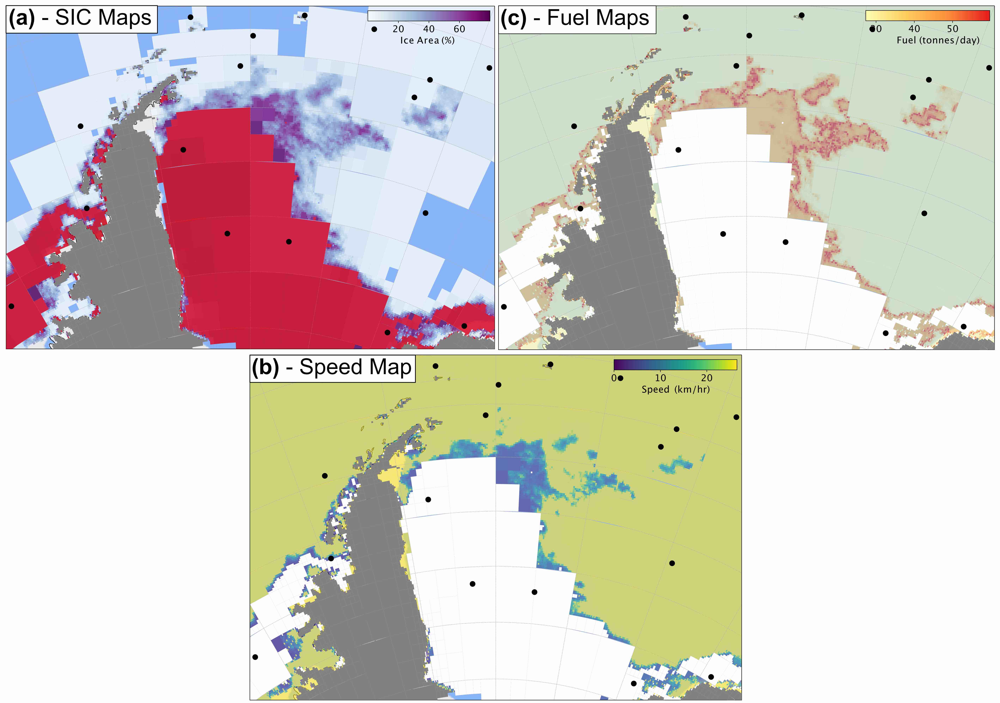
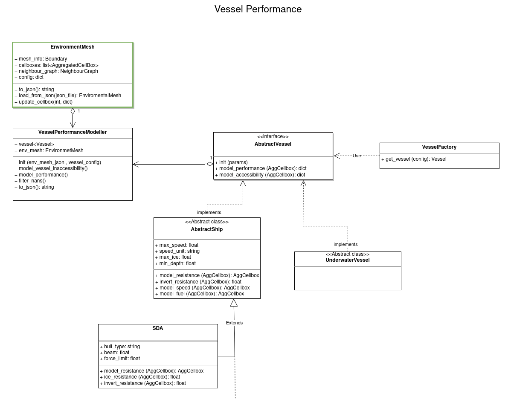

# Methods - Vessel Performance

## Vessel Overview

All of the functionality that relates to the specific vehicle traversing our meshed environment model is contained within the vessel_performance directory.
This directory contains a `VesselPerformanceModeller` class that initialises one of the vessel classes in `vessels` and uses this to determine which cells
in a given mesh are inaccessible for that particular vessel and what its performance will be in each of the accessible cells.

*The sea ice concentration (a), speed (b) and fuel consumption (c) for the SDA across the Weddell Sea.
The latter two quantities are derived from the former.*

*The vessel performance subsystem*

## Vessel Performance Modeller

::: polar_route.vessel_performance.vessel_performance_modeller.VesselPerformanceModeller
   options:
      merge_init_into_class: true
      members:
      - model_performance
      - model_accessibility
      - to_json

## Vessel Factory

::: polar_route.vessel_performance.vessel_factory.VesselFactory
   options:
      members:
      - get_vessel

## Abstract Vessel

::: polar_route.vessel_performance.abstract_vessel.AbstractVessel
   options:
      merge_init_into_class: true
      members:
      - model_performance
      - model_accessibility

## Abstract Ship

::: polar_route.vessel_performance.vessels.abstract_ship.AbstractShip
   options:
      merge_init_into_class: true
      members:
      - model_performance
      - model_accessibility
      - land
      - extreme_ice

## SDA

::: polar_route.vessel_performance.vessels.SDA.SDA
   options:
      merge_init_into_class: true
      members:
      - model_speed
      - model_fuel
      - model_resistance
      - invert_resistance

## Abstract Glider

::: polar_route.vessel_performance.vessels.abstract_glider.AbstractGlider
   options:
      merge_init_into_class: true
      members:
      - model_performance
      - model_accessibility
      - land
      - shallow
      - extreme_ice

## Slocum Glider

::: polar_route.vessel_performance.vessels.slocum.SlocumGlider
   options:
      merge_init_into_class: true
      members:
      - model_speed
      - model_battery

